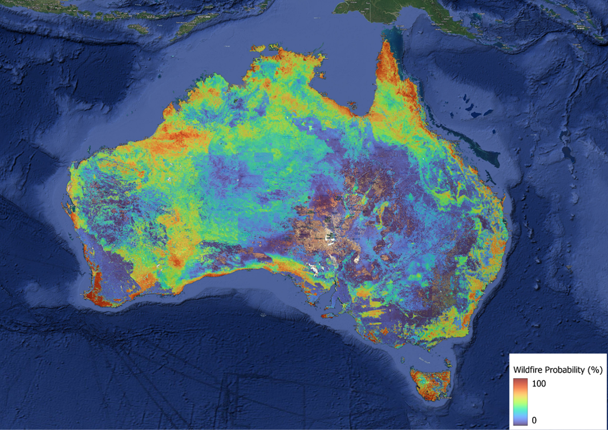
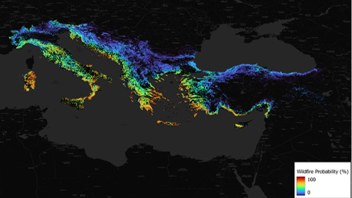
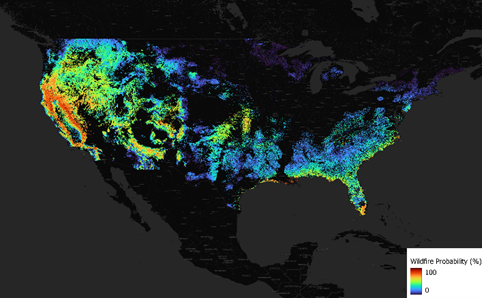

# Wildfire Hazard Modeling

## Introduction
This project models wildfire hazard distribution using the Maximum Entropy (Maxent) algorithm, a proven approach for presence-only ecological niche modeling. The analysis combines observed wildfire occurrence points with environmental, vegetation, topographic, and socioeconomic predictors to produce probabilistic hazard maps for operational wildfire risk assessment.

## Overview
The model predicts areas of high wildfire susceptibility across the study regions by learning relationships between wildfire presence data and key spatial predictors. The results were refined through AI-driven spatial downscaling to improve map resolution to 100 meters, making the hazard outputs more detailed and regionally actionable.

## Data Used 🔥
The wildfire model draws from multiple data categories, including climate, vegetation, topography, and human influence.

### 🌦️ Environmental Data
- 19 Bioclimatic Variables (WorldClim): capture long-term temperature and precipitation trends that shape wildfire suitability.
- Surface Wind Speed: affects fire spread rate and direction.
- Relative Humidity: low humidity increases vegetation dryness and fire ignition risk.

### 🌿 Vegetation Data
- Forest Fire Danger Index (CSIRO/AUS): composite fire danger indicator based on weather and fuel conditions.
- NDVI (Normalized Difference Vegetation Index, CSIRO/AUS): measures vegetation health and biomass as a proxy for fuel availability.
- Forest Type (Classified): forest composition influences fuel structure and burn potential.
- Bushfire Classification Classes and Types (CSIRO/AUS): categorizes fire-prone landscapes with historical and vegetation-based behavior patterns.

### ⛰️ Topography
- DEM (Digital Elevation Model, WorldClim): elevation influences climate, vegetation, and fire behavior.
- Slope: derived from DEM, steeper slopes can accelerate fire spread upslope.

### 🏘️ Socioeconomic Data
- Population Density: human activity is a major ignition source and correlates with wildfire occurrence.

### 🔥 Fire Occurrence Data
- Fire occurrence points (FIRMS 2000-2024): satellite-derived burned-area and active fire points from MODIS, Landsat, and VIIRS.

## Methodology
1. Collected presence-only wildfire occurrence points and aligned them with spatial predictors.
2. Prepared environmental, vegetation, topographic, and socioeconomic layers at a compatible resolution.
3. Trained the Maxent model to estimate wildfire hazard probability from presence data.
4. Evaluated predictive performance using AUC, with test scores in the 0.7 to 0.8 range.
5. Applied AI-driven spatial downscaling to enhance hazard map detail to 100-meter resolution.
6. Modeled future wildfire scenarios using CMIP6 climate projections to assess changing risk patterns.

## Results
The model produced detailed hazard maps showing areas of elevated wildfire susceptibility across the selected regions. The downscaling improved the spatial realism of the outputs and supported region-specific risk assessments.

### Sample Results 🔥
#### Australia

 
*Australia wildfire hazard distribution.*

#### Mediterranean Europe

 
*Mediterranean Europe hazard map outlook.*

#### USA

 
*USA wildfire susceptibility map.*

## Conclusions
The Maxent-based wildfire hazard model successfully captured key environmental and fire behavior drivers. With strong predictive performance and enhanced 100-meter outputs, this work supports more detailed wildfire planning and future scenario assessment under climate change.

## Notes
- The model is best suited for presence-only wildfire data.
- Downscaling and future projections improve operational relevance, but results should be interpreted with local context and expert input.
>>>>>>> 124aa2b (Initial commit)
